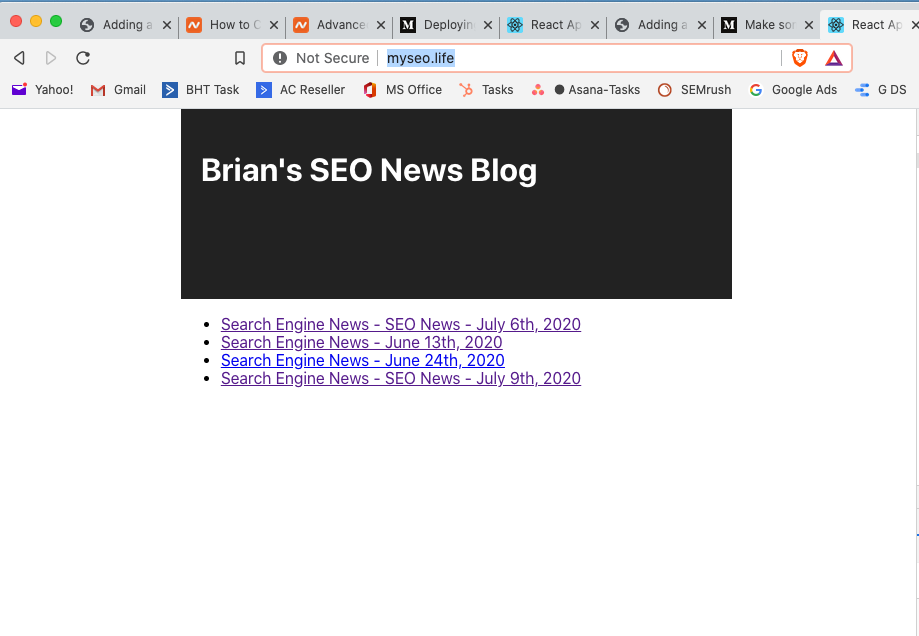

# Brian's First Kentico Kontent Blog

Live URL: <a href="https://silly-sign.surge.sh/" target="_blank">https://silly-sign.surge.sh/</a>

This is my first blog using Kentico Content.  The front end is a simple React app.

Background:
----------------------------------------------------
I did this project to get a feel for how the Kentico Kontent CMS works, and see how easily it integrates with a front-end.

Technology:
----------------------------------------------------
The backend is the Kentico Kontent CMS. The front-end is a simple React app. The live site is deployed on Surge.sh, a host for static sites.

Screenshot for Brian's First Kentico Kontent Blog:
-------------------------------------------------

